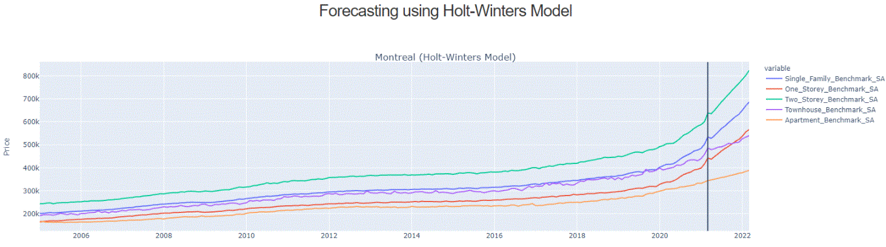

# Final-Project: Housing Price Prediction and Analysis in major Canadian Cities

This is the capstone project! Time to make all the skills you worked so hard for shine.

# Requirements

- A new project on data you gathered yourself. Existing datasets are OK but have a higher bar in terms of difficulty

- The project is deployed in some form -- it's not a static notebook, but has a server component.

- The project can be analysis/visualization or a model. If it's a model you should build an inference server for it taking JSON. If it's an analysis you can build a presentation page using something like https://dash.plotly.com/

- Submit the project on your own repo

[Google Sheet is here](https://docs.google.com/spreadsheets/d/1EaQZuBYEhv606F24Zz324jyfrqWjCKIz4hfLzVRh6rE/edit?usp=sharing)

# Summary of the project

The final project is to predict the future prices of homes in Montreal, Toronto, Vancouver and Quebec City.

The reason behind this project is because I want to be able to own a home. Housing price is always increasing and I want to know how much I would have to save and what the price is going to look like.

There are 2 different time-series models used: ARIMA and Holt-Winters Method.

# Conclusion

Which method is better, ARIMA or Holt-Winters?
Truthfully, one model will work better on one dataset versus another.
For Montreal, Holt-Winters is the preferred method, while Quebec City, Toronto and Vancouver, ARIMA is the preferred method. 
The preferred method is based on my test data and RMSE.

Below is the result of the forecast for Montreal using Holt-Winters Model.

[Click Here](./assets) to view the forecasts on Quebec City, Toronto, & Vancouver.

